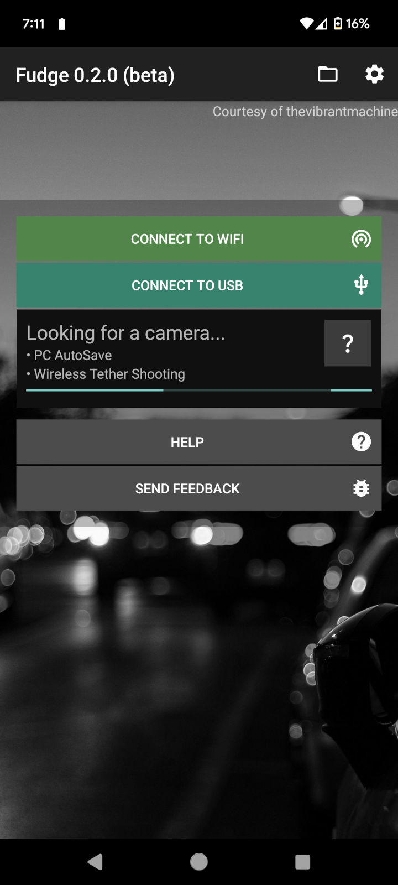
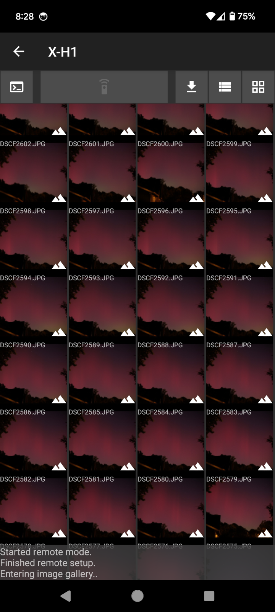
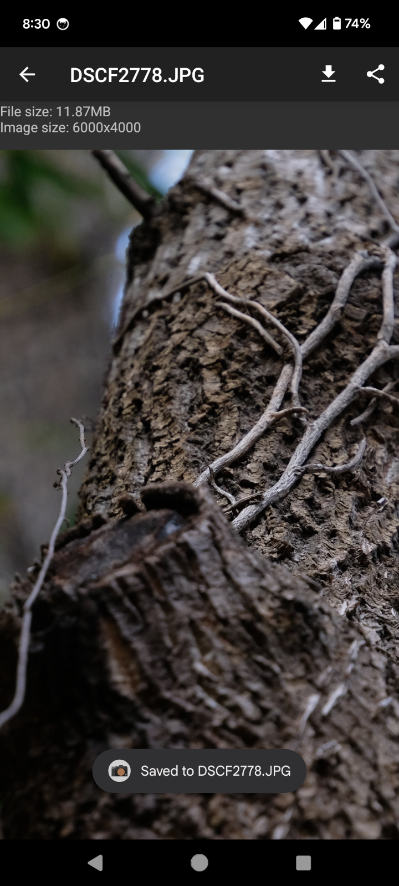

<h3 class="m-text-center m-noindent">Fudge is an open-source alternative to Fujifilm's official camera pairing app.</h3>

Connect through USB or WiFi

Scroll through the image gallery

Select on the image and zoom in

<em>This app isn't finished yet, so don't set high expectations.</em>

___

## Improvements over XApp / Camera Connect
- Location and notification permissions are *not* required or requested
- More responsive native UI
- Slight performance improvements
- USB-OTG connectivity support
- Supports PC AutoSave and (partially) Wireless Tether

## Missing features
- iOS Support
- Bluetooth pairing
- Geolocation
- Liveview/remote shutter

## Ready to try it out?

<a href="https://play.google.com/store/apps/details?id=dev.danielc.fujiapp"></img></a>

<a href="https://apt.izzysoft.de/fdroid/index/apk/dev.danielc.fujiapp"></img></a>

<h3>Windows/Linux/MacOS</h3>Coming Soon

